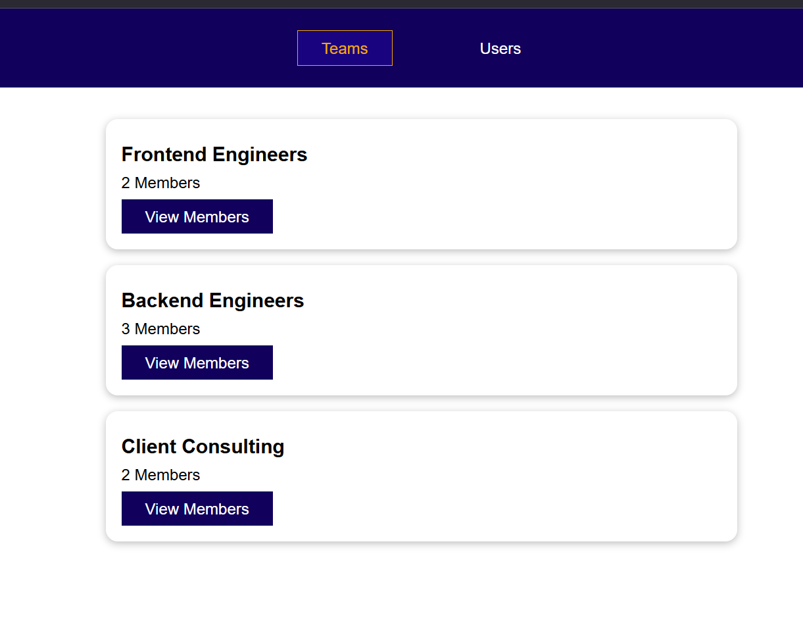

# Genesis
The code is based on "Vue - The Complete Guide" course

[About course](https://www.udemy.com/course/vuejs-2-the-complete-guide/?couponCode=ST8MT101424)

# Technologi used
- HTML
- JavaScript
- Vue
- Vuex

# Example app

## Coach app

The application was created to find a coach to learn programming. You can be a trainer or a student. You can check what kind of students the trainer has

